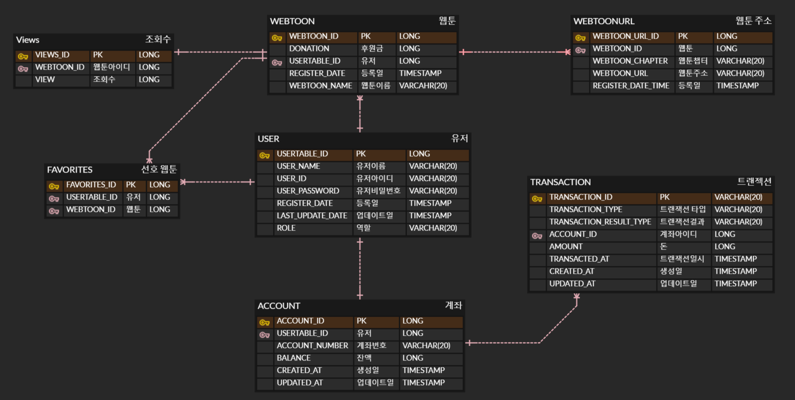

# 웹툰 서비스 만들기

일반적인 웹툰 서비스를 간략화한 웹툰 서비스입니다.

## 프로젝트 기능 및 설계
- 회원가입 기능
    - 사용자는 회원가입을 할 수 있다. 일반적으로 모든 사용자는 회원가입시 USER 권한 (일반 권한)을 지닌다.
    - 회원가입시 아이디와 패스워드를 입력받으며, 아이디는 unique 해야한다.
    - 작가는 웹툰을 작성하고 게시할 수 있는 AUTHOR 권한을 지닌다.

- 로그인 기능
    - 사용자는 로그인을 할 수 있다. 로그인시 회원가입때 사용한 아이디와 패스워드가 일치해야한다.

- 웹툰 열람 기능
    - 로그인한 사용자는 권한에 관계 없이 웹툰을 열람할 수 있다.
    - 웹툰은 조회수순으로 기본 정렬된다.
    - 웹툰 목록 조회시 응답에는 제목과 조회수 정보가 필요하다
- 웹툰 후원 기능
  - 로그인한 사용자는 권한에 관계없이 원하는 웹툰을 후원할 수 있다.

- 웹툰 작성 기능
    - AUTHOR권한을 가진 사용자만 웹툰을 작성할 수 있다.

- 웹툰 정산 기능
  - AUTHOR권한을 가진 사용자는 자신이 작성한 웹툰에 대해 후원한 후원금을 받을 수 있다.

## ERD

## Trouble Shooting
[go to the trouble shooting section](doc/TROUBLE_SHOOTING.md)

### Tech Stack

 
   
  
  
   
  
  

