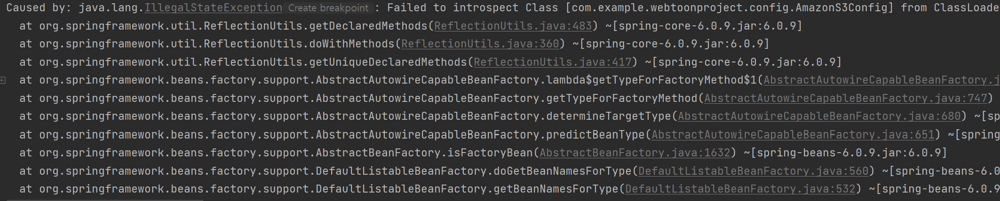
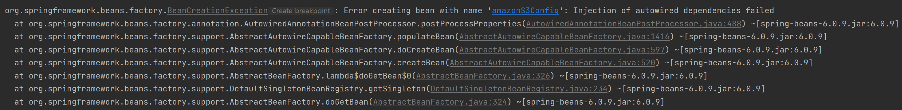

## 1.Test실행시 문제 발생

### 문제 원인 
AWS 사용시에 gradle 입력에 "compileOnly 'org.springframework.cloud:spring-cloud-starter-aws:2.0.1.RELEASE'"만 입력이 되어있었기에
test실행시 구현해놓은 AmazonS3Config에서 AWSCredentials와 AWSCredentials의 클래스를 찾지 못한 것으로 보입니다.
### 해결 방법
gradel에 "testImplementation "com.amazonaws:aws-java-sdk-s3:1.11.914""추가하여 실행하였습니다.

---

## 2. Test실행시 amasonS3Config autowired문제

### 문제 원인
aws.yml에 작성해놓은 secretKey와 accessKey가 제대로 주입되지 않았습니다.
### 해결 방법
test용 yml을 따로 생성하여서 해당 yml에 aws관련 properties들을 작성하여 넣어주었습니다.